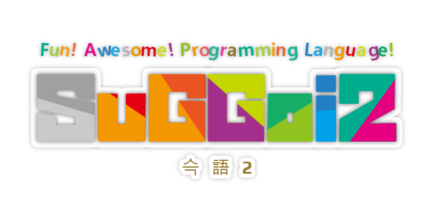

# Kemono Friends Language - 슥語2(SuGGoi2)



Fun! Awesome! Programming Language!<br>
즐겁다! 굉장하다! 프로그래밍 언어!<br>
たのしい！ すごい！ プログラミング 言語！<br>
<br>
Welcome to ようこそジャパリパーク！<br>
うー！がぉー！<br>

## Hello, World!

- English
```
# Print Function
friends English
    '0'
    tanoshi!
    "!dlroW ,olleH"
    uwa~
    omoshiro!
    sugoi!
    wai~
# Main Function
youkoso
    sandstar English
```

- Korean
```
# Print Function
프렌즈 Korean
    '0'
    타노시!
    "!dlroW ,olleH"
    우와~
    오모시로!
    스고이!
    와이~
# Main Function
요코소
    샌드스타 Korean
```

- Japanese
```
# Print Function
フレンズ Japanese
    '0'
    たのし!
    "!dlroW ,olleH"
    うわ~
    おもしろ!
    すごい!
    わい~
# Main Function
ようこそ
    サンドスタ Japanese
```

## Spec

```
[Syntax]
Token : [a-z, A-Z, 0-9, !, ?, -, ~, _]
Code : {Token}{Not Token}{Token}...
Comment : #...[\n, \0]
Command : {Token}

[Interpreter]
'h' = Head : index of 'Command' to execute.
'[p]' = Memory : dynamic array of 1 byte.
'p' = Pointer : index of byte in 'Memory'
'r' = Register : store 1 byte.

[Command]
"..."
    "Hi" : [p]='H' → p+=1 → [p]='i'
'...'
    '0 42' : [p]=0 → p+=1 → [p]=42
ta(-/~)noshi(!) : increase p or [p]
    ta--noshi : [p]+=1 → [p]+=1
    ta~-noshi : [p]*=2 → [p]+=1
    ta-noshi! : [p]+=1 → p+=1
sugo(-/~)i(!) : decrease p or [p]
    sugo--i : [p]-=1 → [p]-=1
    sugo~-i : [p]/=2 → [p]-=1
    sugo-i! : [p]-=1 → p-=1
u(-)wa(~) : jump
    uwa~ : if [p]==0 then move h to wa(-)i~
    u-wa~~ : if [p]==1 then move h to wa(-)i~~
wa(-)i(~) : jump
    wai~ : if [p]!=0 then move h to u(-)wa~
    wa-i~~ : if [p]!=1 then move h to u(-)wa~~
nanikore(?) : input
    nanikore? : [p]=input
    nanikore?? : [p]=input → p+=1 → [p]=input
omoshiro(!) : output
    omoshiro! : output=[p]
    omoshiro!! : output=[p] → p+=1 → output=[p]
la(la) : copy [p]
    la : [p+1]=[p] → p+=1
    lala : [p+2]=[p] → p+=2
    la la : this is two 'Command' that la and la.
mya(mya) : copy [p]
    mya : [p-1]=[p] → p-=1
    myamya : [p-2]=[p] → p-=2
    mya mya : this is two 'Command' that mya and mya.
shaberu : r=[p]
shabetta : [p]=r
youkoso : declare main function
friends {Token} : declare function named {Token}
sandstar {Token} : call function named {Token}
```
